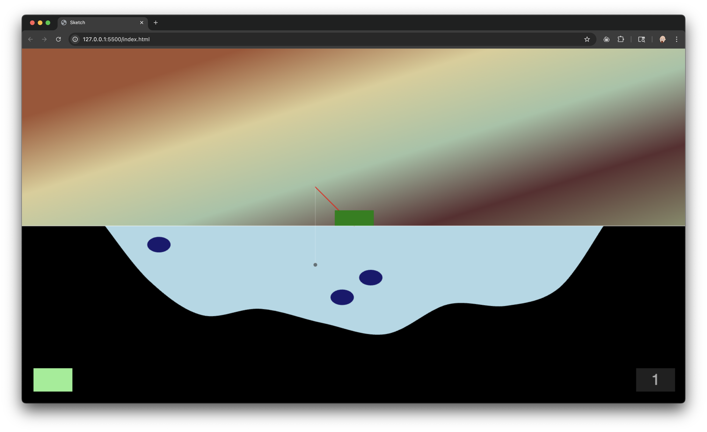

# Fishing Game

This is a sample repository that you can use to set up your own p5.js repo for
working locally (on your own computer) and socially (because you're using git).

This was my example from Fall 2024 for a class assignment for people to build an
interactive graphics project in Javascript. There is a proposal document that
outlines my initial aspirations for the project in [proposal.md](proposal.md).

**The details of this code is not important.** The purpose of this repo is to
show you one way to _structure_ a project so that it will work for you and your
colleagues outside of the p5 web-based editor. The web editor is a wonderful
starting point, but it will end up constraining you in the long term. So I want
to show you how to set something up for local development.

## Important Files

Please take a look at each of the files that I mention here so you can
understand how to edit them to meet your needs.

- **index.html** is the entry point. This is an HTML file, which means it has
  markup that makes sense to web browsers. Think of this as the main recipe the
  the browser users to show you content. It has several important parts:
  - **title** is the name of your web page (it shows in the browser tab)
  - **link to style.css** for graphic styling - see below
  - **several script references** that brings in javascript code from the
    indicated files. The first three of these are libraries for p5's graphics
    and sound, and another 3rd party library that is hosted on the internet (not
    locally). The second batch of these (in the `<body>` tag) are references to
    the game code.
- **src/sketch.js** is your main p5 file. It has your setup and draw functions.
- **all other files in src/** are the additional files that breaks the game up
  into reasonable pieces. There's code for the fisher boat, the game, the fish,
  etc.
- **style.css** is a 'cascading style sheet', and this defines visual graphic
  styles that in this case just removes the padding and margin around the
  document so it snugs up against the browser's edges.

For you to make your own p5 app locally, you can copy the `index.html`,
`style.css` files, and the `libraries/` folder with everything in it. You'll
also need to create the `src/` directory that minimally has a `sketch.js` file
in it.

Be sure to edit `index.html` so it refers to the files you actually have in your
`src/` directory, and be sure that `sketch.js` is the last thing that it
references.

For the record, `package.json` and `package-lock.json` aren't important in this
particular case.

## Get the Live Server extension

In VS Code, go to your Extensions panel (View / Extensions menu). Search for
"Live Server" and get the one by Ritwick Dey. Once that is installed, you can
right click on `index.html` and it gives the option "Open with Live Server".
This just creates a tiny web server running on your computer, and then opens a
browser to hit this file. If your code is set up correctly, it should run your
p5 sketch.

In my case it looks like this:

## Use Git

You can use git to manage your source code and collaborate with others. Or use
git to simply save your code to Github so you always have it!

There are a few steps to take when working in a git repo. You can do this via the command line, or the editor's built-in git panel (View / Source Control menu), or with a different git app like Github Desktop. The process is the same in any case.

1. Edit code as usual.
2. When you want to create a "save point" as I like to say, there are three
   steps:
   - **Stage** the files you want to commit
   - **Commit** the staged files with a commit message
   - **Push** your changes to Github (this step puts your edited code on Github)
3. If you're working with somebody else, and they've pushed changes to Github,
   you can **pull** their changes
   - Sometimes your code will conflict with the code on Github. In this case
     you get to resolve the conflict.
